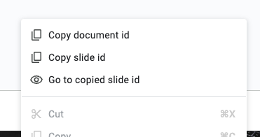

# Fast document & slide ID copy

Extension for Google Slides that allows you more actions :

- Copy the current document ID
- Copy the current slide ID (editor opened)
- Go to slide based on the copied ID

These options are available in any custom google context menu by right-clicking in any empty space of a slide, in a slide thumbnail, in a item (text, image...).

> [!WARNING]  
> Right clicking on a slide thumbnail won't copy it's ID, but the current slide ID (editor opened).

